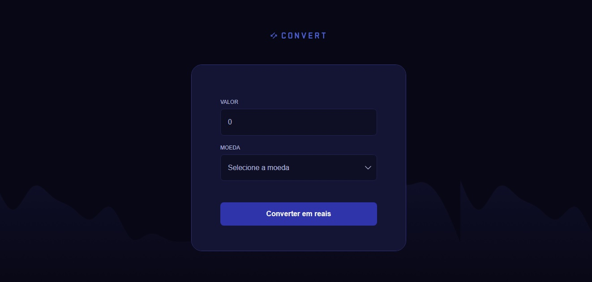

<h1 align="center">
  Convert </>
</h1>

Convert é um site desktop conversor cambial de moedas.  
Esse é um dos desafios práticos da formação Fullstack, um dos conteúdos disponíveis para alunos da Rocketseat. 

  <a href="#-tecnologias">Tecnologias</a>&nbsp;&nbsp;&nbsp;|&nbsp;&nbsp;&nbsp;
  <a href="#-projeto">Projeto</a>&nbsp;&nbsp;&nbsp;|&nbsp;&nbsp;&nbsp;
  <a href="#memo-licença">Licença</a>

  

 

  

## 🚀 Tecnologias

Esse projeto foi desenvolvido com as seguintes tecnologias:

- HTML
- CSS
- JavaScript

## Projeto

Nesse projeto desenvolvemos um site desktop conversor cambial para praticar o nosso conhecimento com:

   - JavaScript
   - Manipulação da DOM; 
   - Funções;
   - Eventos;
   
   
   
   
   
  
                      Desenvolvido por Juliano Castro com mentoria da Rocketseat.